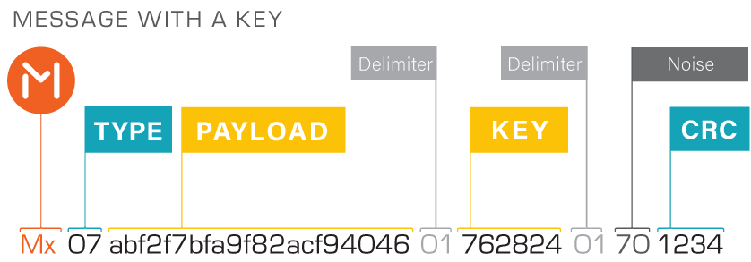

# bip39-address-key2value

Passing the key and value in the wallet address

----

### Examples:
Address | Value
--- | --- 
Mx0248656c6c6f20576f726c64016b65790165b525 | `key='key', value='Hello World'`
Mx033fd47ae147ae140001626970012d2b6a444655 | `key='bip', value=0.32`
Mx07d83ddc4d016b6579310132335d56645d569cd7 | `key='key1', value='👍'`
Mx01f5c6f51501636f756e740164587b202a777c51 | `key='count', value=4123456789`
Mx070420044304410441043a0438043903016bfc21 | `key=null, value='Русский'`
 
[Online demo of encoding and decoding](https://github.com/counters) 

----

Prefix |Type| Payload | | Key|  |Noise| CRC | Description
---|---|---|---|---|---|---|---|---
Mx| | | | | | | |
| |02| | | | | | |Text ASCII
| | |48656c6c6f20576f726c64016b6579 | | | | | | Hello World
| | | |01
| | | | |6b6579 | | | |key
| | | | | |01
| | | | | | |65
| | | | | | | |b525

##### Registered types

Type | Dec | Hex
---|---|---
RAW|0|00
INTEGER|1|01
ASCII|2|02
DOUBLE|3|03
BINARY|4|04
UNIXTIME|5|05
DATETIME|6|06
UTF-8|7|07
Minter PIP|8|08
Other type|255|ff

Keyless encoding is also possible. [Picture](docs/static/Message_without_a_key.png)

### Libraries
Languages| Supported types | Url 
---|---|---
Javascript|Integer, Double, ASCII|[comming soon](https://github.com/counters)
Kotlin|Integer, ASCII|[comming soon](https://github.com/counters)
