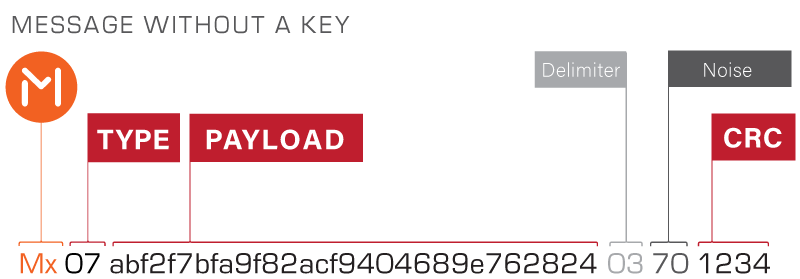

# bip39-address-key2value

----

Prefix | Type | Payload | | Key|  |Noise| CRC | Descr
---|---|---|---|---|---|---|---|---
Mx| | | | | | | |
| |02| | | | | | |Text ASCII
| | |48656c6c6f20576f726c64016b6579 | | | | | | Hello World
| | | |01
| | | | |6b6579 | | | |key
| | | | | |01
| | | | | | |65
| | | | | | | |b525

Example:
`Mx0248656c6c6f20576f726c64016b65790165b525` = `key='key', value='Hello World'`

[Online demo of encoding and decoding](https://github.com/counters)

### Libraries
Languages| Supported types | Url 
---|---|---
Javascript|Integer, Double, ASCII|[comming soon](https://github.com/counters)
Kotlin|Integer, ASCII|[comming soon](https://github.com/counters)
